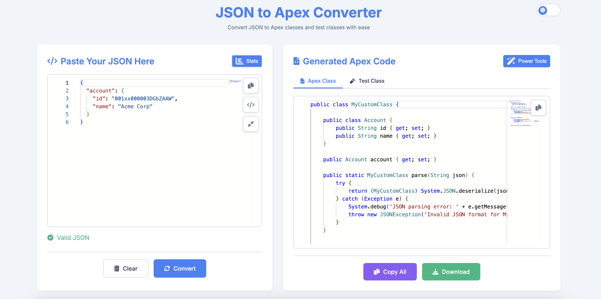
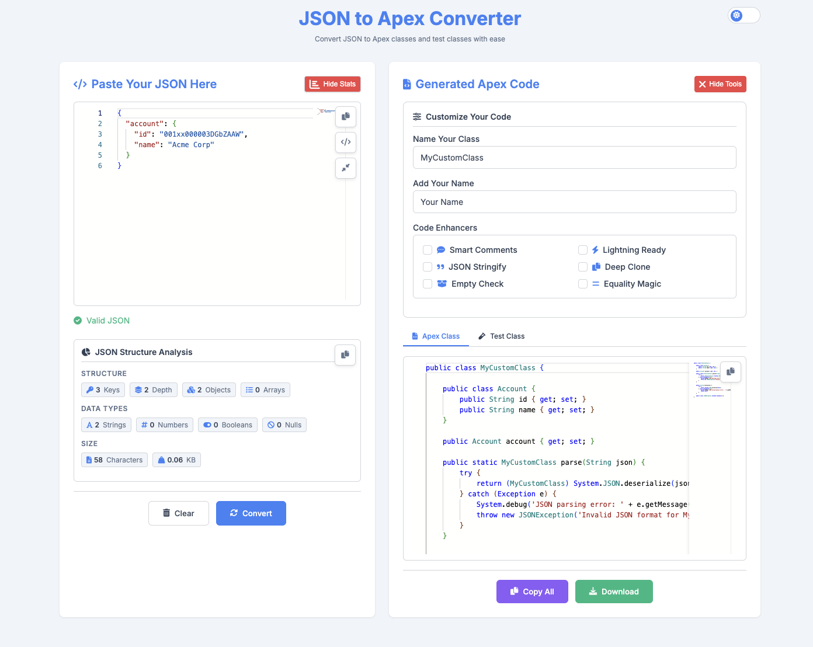
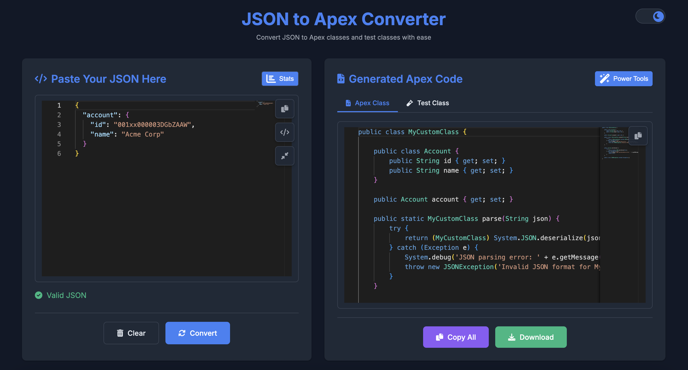

# ApexGenie – JSON to Apex Converter for Salesforce Developers 🧙‍♂️

[](https://opensource.org/licenses/MIT)   
[](https://github.com/Kartikpatkar/apexgenie)   
[](https://chromewebstore.google.com/detail/apexgenie-json-to-apex-co/ifliljlnfdnmagdgmomglfoimjcnpinb)

<!--**Coming soon to the [Chrome Web Store](#)** 🚀
<!-- Update with real link once published
[](https://chromewebstore.google.com/detail/apexgenie-json-to-apex-co/ifliljlnfdnmagdgmomglfoimjcnpinb)-->

Transform your JSON into Salesforce-ready Apex classes and comprehensive test classes instantly with ApexGenie!

---

## 🚀 Overview

ApexGenie is a powerful Chrome Extension designed specifically for Salesforce developers. Convert complex JSON data structures into clean, idiomatic Apex wrapper and test classes right in your browser. Whether you’re building REST integrations, mocking test data, or developing Lightning Web Components (LWC) and Aura components, ApexGenie automates repetitive coding, saving you hours of development time.

---

## ✨ Features

- **Advanced JSON Editor**  
  Real-time syntax validation, pretty print, minify, and clipboard copy for JSON input.

- **Instant Apex Code Generation**  
  Generates Apex wrapper/DTO classes and test classes simultaneously with customizable options.

- **Smart Customization Options**  
  Set class names, author tags, toggle `@AuraEnabled` properties, and include utility methods like `toString()`, `clone()`, `equals()`, and `isEmpty()`.

- **JSON Structure Analyzer**  
  Provides insights into JSON key count, depth, size, and data type breakdown for better understanding and Apex limit considerations.

- **User-Friendly UI**  
  Light/dark themes, side-by-side JSON input and Apex output panels, tabs for class/test code, and easy copy/download buttons.

- **Offline & Secure**  
  All processing is client-side; no data leaves your browser, ensuring privacy and offline capability.

---

## 📸 Screenshots

### 🔹 JSON Input & Apex Output



### 🔹 Code Customization Options



### 🔹 Dark Mode UI



---

## 📦 Installation

### ✅ Option 1: [Chrome Web Store](#)

You can install **JSON to Apex Genie** directly from the Chrome Web Store:

👉 [Install from Chrome Web Store](https://chrome.google.com/webstore/detail/json-to-apex-genie/ifliljlnfdnmagdgmomglfoimjcnpinb)

Once installed:
- Click the extension icon in your browser toolbar
- Paste your JSON
- Instantly generate Apex classes with options for class name, type visibility, and formatting

> ✅ No login or setup required. Works 100% offline.

### 🔧 Option 2: Load ApexGenie Manually in Chrome

Until it's available in the Chrome Web Store, you can load ApexGenie manually for development or testing:

1. **Clone or Download this Repository:**

   ```bash
   git clone https://github.com/Kartikpatkar/apexgenie.git
   ```

   Or download the ZIP from GitHub and extract it.

2. **Open Chrome and go to the Extensions page:**

   ```
   chrome://extensions/
   ```

3. **Enable Developer Mode:**

   Toggle the **Developer mode** switch in the top right corner.

4. **Click "Load unpacked":**

   - Select the root folder of the project (the one containing `manifest.json`).

5. **Done!**

   - You’ll now see ApexGenie in your extensions bar.
   - Click the icon to launch and start generating Apex!

---

## 📖 Usage

1. Click the ApexGenie icon to open the extension.  
2. Paste or write your JSON data into the left editor panel.  
3. Use **Format JSON** or **Minify JSON** for better input structure.  
4. Review JSON analysis for complexity insights.  
5. Customize the output by setting class name, author, enabling `@AuraEnabled`, and selecting utility methods.  
6. Click **Convert to Apex** to generate code.  
7. Review Apex and Test classes on the right panel.  
8. Copy to clipboard or download `.cls` files for immediate Salesforce deployment.

---

## 🛠 Power Tools (Advanced Customizations)

- **`@AuraEnabled` Toggle** – Makes properties accessible to Lightning components.  
- **Smart Comments** – Adds clear, instructive comments in generated Apex code.  
- **Utility Methods** – Add `toString()`, `clone()`, `equals()/hashCode()`, and `isEmpty()` methods for enhanced Apex class functionality.

---

## 🧠 Author Info

Built by **Kartik Patkar**  
🔗 [GitHub](https://github.com/Kartikpatkar) • [LinkedIn](https://linkedin.com/in/kartik-patkar) • [Trailhead](https://www.salesforce.com/trailblazer/kpatkar1)

---

## 🤝 Contributing

Contributions, issues, and feature requests are welcome!  
Feel free to fork the repository and submit pull requests.

Please adhere to the [Code of Conduct](CODE_OF_CONDUCT.md) and review [CONTRIBUTING.md](CONTRIBUTING.md) for guidelines.

---

## 📄 License

This project is licensed under the MIT License – see the [LICENSE](LICENSE) file for details.

---

> Built for Salesforce developers, by Salesforce developers.  
> ApexGenie helps you write better Apex, faster!
